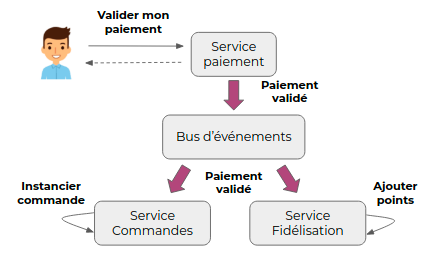

# Event Driven

Une architecture orientée événements (en anglais : event-driven architecture) permet :
- de découpler les composants et de les rendre indépendants. Et donc d'améliorer la résilience, car si un composant tombe en panne, il n'affecte pas les autres.
- la scalabilité : si un service à des traitements longs, on peut facilement augmenter le nombre d'instances de celui-ci.
- d'ajouter des consommateurs sans impacter les producers. Par exemple ajouter un service d'analyse de data. 

Risques :
- Temps de désynchronisation entre le producer et les consommateurs. Il faut s'assurer que les consommateurs consomme plus vite que les producers.
- 