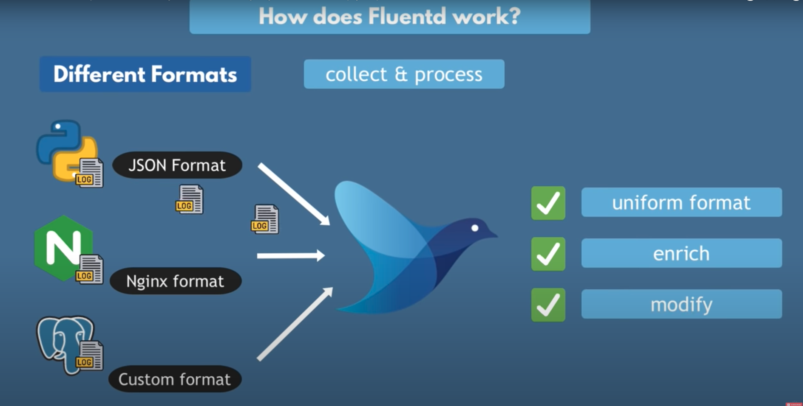

# Introduction : 
## Pourquoi les logs :
Les logs peuvent service de donner pour : 
* Donner spécifique sur l'utilsiation de l'app
* Sécurité de l'app (access log), quelles données sont accéder et quand
* Debugger quand il y a des erreurs

## Pourquoi fluentd :
Toutes les apps logs dans un fichier que ce soit du NodeJs, Java, python, MySQL, etc., dans un format différent (timestamps, log level, etc).
Il y a beaucoup de fichier différent et non lisibles pour l'utilisateur.

Il est possible d'envoyer directement les logs dans une BDD comme ElasticSearch afin de centraliser les logs.
On doit alors configurer chaque app afin d'envoyer les donénes dans le même format. Et il y a des apps que l'on ne peut pas configurer comme les applications tiers (bdd, message broker) ou comme le controller nginx de K8s ou les logs de l'infra.

FluentD répond à toutes ces problématiques :

## Comment ça marche
FluentD est déployé dans le cluster et commence à récupérrer les logs de tous les conteneurs.
Les logs sont donc dans différents formats, FluentD va alors les récupérer et appliquer un traitement afin de logs reformater en un format uniform.
Il peut également les enrichir en rajoutant des données comme le nom du Pod, namespace, etc. On peut également modifier les données des logs.

Après le process de collect et de modification, FLuentD peut envoyer ces logs à différentes destination comme ELK, MongoDB, etc.
On peut choisir par type de logs où envoyer les données, par exempler envoyer les logs du nginx à Mongo et les donénes backend à ELK, etc.
FluentD propose alors un système de routing.

FluentD stock les messages sur disque quand il les collecte et les transforme. Ainsi si le serveur vient à redémarrer les logs seront quand même repris et envoyer aux destinations.
De même si les destinations sont indisponibles pour cause d'erreur rédeau ou autre, FluentD réessayera de les envoyer à ces destionations avec un système de retry.

La force de FluentD est les tags. Grâce à eux on peut regrouper les traitements des logs. Exemple tous les logs myapp.* sont traités de tels manière et envoyé à tel endroit.

# Configuration
FluentD s'installe comme un DaemonSet dans K8s et il se configure via un système de plugins pour faciliter la configuration.
On le configure de la manière suivante :
1. Les inputs <source>
2. Le système de parsing des logs
3. Enrichissement des logs avec les record_transformer ou modification des data (par exemple anonymiser les données)
4. Les outputs 
